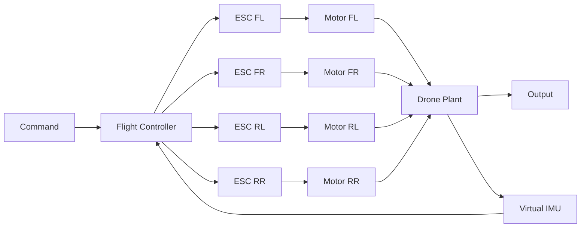
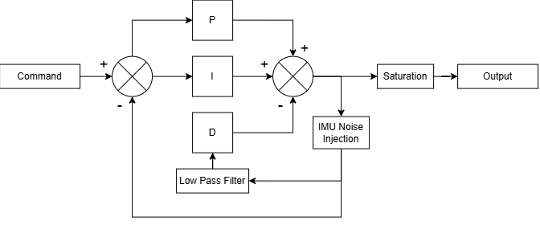

# Simulation and Control Architecture

```mermaid.js
flowchart LR
    A[Command] --> B[Flight Controller]
    B --> C[ESC FL]
    B --> D[ESC FR]
    B --> E[ESC RL]
    B --> F[ESC RR]
    C --> G[Motor FL]
    D --> H[Motor FR]
    E --> I[Motor RL]
    F --> J[Motor RR]
    G --> K[Drone Plant]
    H --> K[Drone Plant]
    I --> K[Drone Plant]
    J --> K[Drone Plant]
    K --> L[Output]
    K --> M[Virtual IMU]
    M --> B
```
## Flight Controller Block Diagram
